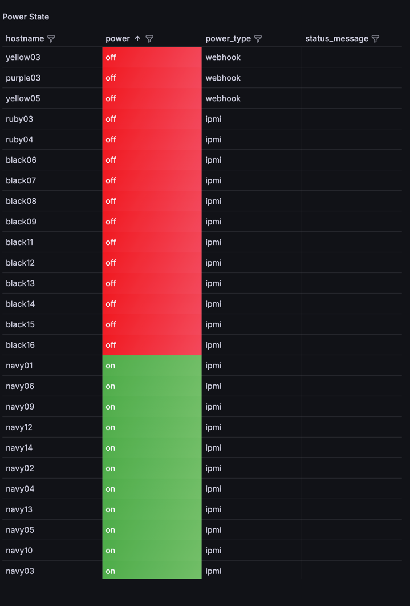

# MAAS API Metrics Exporter


This is a lightweight Flask-based Prometheus exporter for collecting machine power and status metrics from a [MAAS](https://maas.io/) (Metal-as-a-Service) instance.

It queries the MAAS API, processes machine data, and exposes it in a Prometheus-compatible format at /metrics.

# Local Development

Prerequisites:
	•	Python 3.10+
	•	pip install -r requirements.txt

# Run
```
python main.py
```
Open http://localhost:9200/metrics to see the metrics output.

# Prometheus Configuration

```commandline
scrape_configs:
  - job_name: 'maas_api_exporter'
    static_configs:
      - targets: ['<host>:9200']
```

# Example Metrics Output
```commandline
maas_machine_status{hostname="black14",power_status="Ready",zone="SGG01-U2-706"} 1
maas_machine_power_state{hostname="black14",power="off",status_message="",power_type="ipmi"} 1
```

# Notes
	•	The exporter uses OAuth 1.0 PLAINTEXT auth (same as MAAS CLI)
	•	Machine list output is compatible with both paginated and flat MAAS responses

